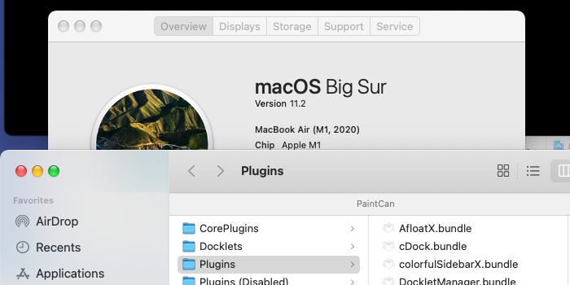

# PaintCan



# Information:

- `About         :` PaintCan is a MacForge Plugin that lets you apply custom car files on the without rebooting. This plugin is based on the original parasite extension FreshPaint. Now using `NSAppearance` instead of `CUIThemeFacet`.
- `System        :` macOS 10.14+
- `FreshPaint    :` [alexzielenski](https://github.com/alexzielenski) ([FreshPaint](https://github.com/ParasiteTeam/extensions/tree/master/FreshPaint))
- `PaintCan      :` [w0lfschild](https://github.com/w0lfschild) ([MacEnhance](https://github.com/MacEnhance))
- `Other Info    :` [ZKSwizzle](https://github.com/alexzielenski/ZKSwizzle)
- `Extra         :` If you do make some changes, feel free to make a pull request and help make things more awesome!

# Directions :

1. Copy `Aqua.car` and `DarkAqua.car` from
```sh
/System/Library/CoreServices/SystemAppearance.bundle/Contents/Resources/
to
/Library/Application Support/MacEnhance/Plugins/PaintCan.bundle/Contents/Resources/
```
2. Change the file names to  `NSAppearanceNameAqua.paintcan.car` and `NSAppearanceNameDarkAqua.paintcan.car`
3. Modify the `.car` files to your liking
4. Restart any app to see changes applied (log out and back in to apply changes to all apps)
5. When an app opens or the system change from light to dark mode it will load your custom appearance if it exists

# Installation:

1. Download and open [MacForge](https://github.com/w0lfschild/app_updates/raw/master/MacForge1/MacForge.zip)
2. Install [PaintCan](https://www.macenhance.com/mflink?com.macenhance.paintcan)
